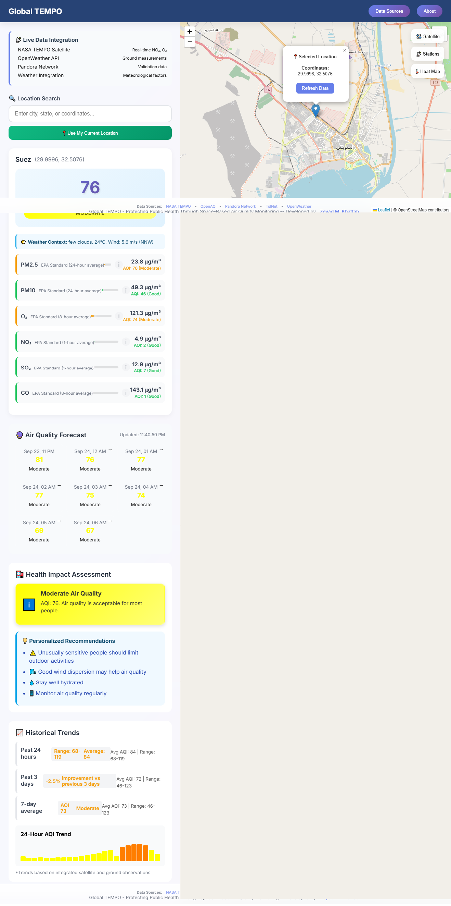

# 🌍 Global TEMPO

[](https://globaltempo.netlify.app/)
[](LICENSE)
[](https://nodejs.org/)
[](https://www.mongodb.com/)
[](#-contributing)

**Global TEMPO** is a public health application that makes life-saving air quality data accessible to everyone. It integrates real-time satellite data from **NASA's TEMPO mission** with global ground sensors and weather forecasts to provide a complete, localized picture of the air we breathe.

The platform not only visualizes complex pollution data on an interactive map but also sends **personalized health alerts** to vulnerable users based on their specific health profiles. By combining satellite technology, a custom-built local sensor network, and a user-centric design, Global TEMPO empowers communities to understand their environment and take action to protect their health.

---

## ✨ Features

### Core Application

- **📊 Real-Time AQI & Weather**: Get up-to-the-minute Air Quality Index (AQI) based on US EPA standards, integrated with current weather context.
- **🗺️ Interactive Global Map**: A Leaflet-based map to visualize air quality for any location worldwide.
- **📈 Forecasts & Historical Trends**: View hourly air quality forecasts and analyze historical data trends to understand pollution patterns.
- **🌐 Multi-Language Support**: Fully internationalized interface supporting both English and Arabic (RTL).
- **🔍 Advanced Search**: Find locations by city name, coordinates, or by using your device's current location.

### 🛰️ Satellite Data Integration

- **NASA TEMPO Viewer**: A dedicated map interface to visualize near real-time NO₂, O₃, and Formaldehyde data layers directly from the NASA TEMPO satellite over North America.
- **GEMS Satellite Data**: Integrates data from South Korea's GEMS satellite, providing similar air quality insights over Asia.
- **On-Demand Loading**: GEMS satellite imagery is fetched and cached on-demand by the server to ensure performance and data freshness.

### 🔔 Personalized Notification System

- **Health-Profile Based Alerts**: Users can subscribe to notifications and create a detailed health profile (age, respiratory conditions like asthma, pregnancy, etc.).
- **Customizable Triggers**: Set personal AQI thresholds and notification frequency (real-time, daily, etc.) to receive alerts that matter to you.
- **Intelligent Backend**: A cron job runs hourly, checking air quality for each subscriber's location and sending beautifully formatted HTML email alerts with personalized health advice when thresholds are met.
- **Full Subscription Management**: Users can subscribe, manage preferences, and unsubscribe through secure, unique links.

### 🔬 Community Science & Hardware

- **Arduino Prototype**: A custom-built, Arduino-based hardware sensor for hyper-local environmental monitoring (Temperature, Humidity, Light, Rain, Water Temperature).
- **Open Hardware**: A dedicated page showcases the hardware design and data transmission workflow, encouraging community participation and data contribution.

---

## 🖼️ Screenshots

|                                     Main App Interface                                      |                                 Satellite Data Viewer                                 |
| :-----------------------------------------------------------------------------------------: | :-----------------------------------------------------------------------------------: |
|             |  |
|                                **Notification Subscription**                                |                                **Hardware Prototype**                                 |
|  |                            |

---

## 🛠️ Technology Stack

### **Frontend**

- **HTML5 / CSS3**: Semantic, responsive, and mobile-first design.
- **JavaScript (ES6+)**: Handles all client-side logic, API interactions, and dynamic content.
- **Leaflet.js & Esri-Leaflet**: Powers the interactive maps and satellite imagery layers.
- **GSAP**: Used for smooth animations and a polished user experience.

### **Backend**

- **Node.js / Express.js**: Serves the application and provides a robust REST API.
- **MongoDB / Mongoose**: Database for storing user subscriptions and preferences.
- **Nodemailer**: Sends personalized HTML email notifications.
- **Axios**: Handles server-side requests to external APIs.
- **Node-Cache**: In-memory caching for API responses to improve performance.
- **Node-Cron**: Schedules the hourly job to check for and send notifications.
- **Serverless Functions**: Configured for deployment on platforms like Netlify/Vercel.

---

## 🌐 Data Sources

- **NASA TEMPO**: Near real-time satellite imagery for NO₂, O₃, and HCHO over North America.
- **GEMS**: Satellite imagery for air pollutants over Asia.
- **OpenWeatherMap**: Provides current weather, air pollution data (current, forecast, historical), and geocoding services.
- **OpenAQ**: Used for validating and supplementing ground-based sensor data.
- **WHO**: World Health Organization guidelines are referenced for health recommendations.

---

## ⚙️ Installation & Setup

### 1️⃣ Clone the Repository

```bash
git clone https://github.com/zeyad-khattab/Global-TEMPO.git
cd Global-TEMPO
```

### 2️⃣ Install Dependencies

```bash
npm install
```

### 3️⃣ Configure Environment Variables

Create a `.env` file in the project root and add your API keys and database connection string:

```ini
# API Keys
OPENWEATHER_API_KEY=your_openweather_api_key
OPENAQ_API_KEY=your_openaq_api_key
OPEN_API_GEMS=your_gems_api_key

# Database
MONGODB_URI=your_mongodb_connection_string

# Email Service (for notifications)
EMAIL_SERVICE=gmail
EMAIL_USER=your_email@gmail.com
EMAIL_PASSWORD=your_email_app_password
CONTACT_EMAIL=your_contact_form_recipient@example.com
```

### 4️⃣ Run the Application

```bash
node server.js
```

### 5️⃣ Access the App

Open your browser and navigate to:

```
http://localhost:3000
```

---

## 👤 Authors

- **Zeyad M. Khattab** - Fullstack & Project Lead
- **Omar Abdullah** - Frontend Developer
- **Mohamed Said** - Hardware Developer
- **Kareem Mahmoud** - Researcher
- **Youssef Mohammed** - Business Modeler

---

## 🤝 Contributing

Contributions are welcome! Please fork the repository and submit a pull request. For major changes, open an issue first to discuss what you'd like to change.

---

## 📜 License

This project is licensed under the [MIT License](LICENSE).
