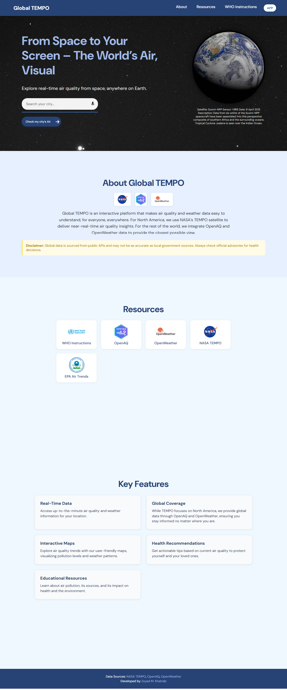

# 🌍 Global TEMPO

[](https://nodejs.org/)
[](https://expressjs.com/)
[](LICENSE)
[](#-contributing)

**Global TEMPO** is a comprehensive web application that delivers **real-time air quality** and **weather data** worldwide.  
It aggregates information from multiple trusted sources — including **NASA's TEMPO satellite** for North America and **OpenAQ** & **OpenWeather** for global coverage — to give users a complete picture of their environment.

---

## ✨ Features

- **📊 Real-Time Data** – Up-to-the-minute Air Quality Index (AQI) and weather information.
- **🗺️ Interactive Maps** – Visualize air pollution levels and weather patterns on a responsive, user-friendly map.
- **🩺 Health Recommendations** – Actionable advice to protect yourself and your family based on current AQI.
- **📚 Educational Resources** – Learn about air pollution, its sources, and its effects on health and the environment.
- **🎙️ Voice Search** – Quickly search for locations using voice input.

---

## 🖼️ Screenshots

| Landing Page | Interactive Map |
|-------------|----------------|
|   |  |


---

## 🛠️ Technology Stack

### **Frontend**
- **HTML5** – Page structure.
- **CSS3** – Mobile-first, responsive design.
- **JavaScript** – API calls, map rendering, and interactive functionality.

### **Backend**
- **Node.js** – Runtime environment.
- **Express.js** – Web framework for API routing and serving static files.
- **Axios** – HTTP client for external API calls.
- **Dotenv** – Securely loads environment variables.

---

## 🌐 Data Sources

- **NASA TEMPO** – *Tropospheric Emissions: Monitoring of Pollution*, providing air quality data for North America.
- **OpenAQ** – Global open-source air quality data aggregator.
- **OpenWeatherMap** – Global weather and forecast data.

---

## ⚙️ Installation & Setup

### 1️⃣ Clone the Repository
```bash
git clone https://github.com/your-username/global-tempo.git
cd global-tempo
```
### 2️⃣ Install Dependencies
```node
npm install
```
### 3️⃣ Configure Environment Variables

Create a .env file in the project root and add your API keys:
```.env
OPENWEATHER_API_KEY=your_openweather_api_key
OPENAQ_API_KEY=your_openaq_api_key
```
### 4️⃣ Run the Application
```node
node server.js
```
### 5️⃣ Access the App

Open your browser and navigate to:

http://localhost:3000

##  👤 Author

Zeyad M. Khattab